# 🛸 planetitas

Your last year of GitHub contributions as a little solar system. One planet per
active month — the busier the month, the bigger the planet. The biggest one
gets rings; the rest roll their own look — craters, stripes, a storm, a polar
ice cap, a little moon, a hazy atmosphere, or an asteroid belt (stable between
regenerations). A UFO (with alien) cruises through. Stars twinkle.

<picture>
  <source media="(prefers-color-scheme: dark)" srcset="demo/space-dark.svg" />
  
</picture>

It's a single Node script with zero dependencies that fetches your contribution
calendar from the GitHub GraphQL API and writes two animated SVGs (light and
dark — space stays dark in both, as it should). Planets pop in one by one and
drift gently, the starfield uses a fixed seed so it doesn't reshuffle on every
regeneration, and `prefers-reduced-motion` is respected.

## Use it on your profile

1. Copy [`space.mjs`](space.mjs) into your profile repo (the one named like
   your username) as `scripts/space.mjs`.

2. Add a workflow at `.github/workflows/space.yml`:

   ```yaml
   name: generate space

   on:
     schedule:
       - cron: "0 12 * * *" # once a day
     workflow_dispatch:
     push:
       branches:
         - main

   permissions:
     contents: write

   jobs:
     generate:
       runs-on: ubuntu-latest
       timeout-minutes: 10
       steps:
         - uses: actions/checkout@v4

         - name: generate space.svg
           run: node scripts/space.mjs ${{ github.repository_owner }} dist
           env:
             GITHUB_TOKEN: ${{ secrets.GITHUB_TOKEN }}

         - name: push space to the output branch
           uses: crazy-max/ghaction-github-pages@v4
           with:
             target_branch: output
             build_dir: dist
           env:
             GITHUB_TOKEN: ${{ secrets.GITHUB_TOKEN }}
   ```

3. Add the image to your profile `README.md`:

   ```html
   <picture>
     <source media="(prefers-color-scheme: dark)" srcset="https://raw.githubusercontent.com/YOUR_USER/YOUR_USER/output/space-dark.svg" />
     
   </picture>
   ```

The first run triggers on push; after that it refreshes once a day.

## Local preview

```bash
GITHUB_TOKEN=$(gh auth token) node space.mjs your-username out
open out/space.svg
```

## Notes

- Planet size scales with √(contributions), so one wild month doesn't turn the
  rest into asteroids.
- Months with zero contributions don't get a planet. Empty space is part of
  the look — a quiet year is a minimalist solar system, not a sad one.
- `--lang` picks the language of the caption and month labels: `en` (default)
  or `es`. Adding another language is four lines in the `LOCALES` table at the
  top of the script.
- Sibling project: [panqueques](https://github.com/malenitaa/panqueques) 🥞 —
  same idea, but the months stack up as pancakes.

## Enjoyed it?

If this was useful and you'd like to support the project:

- [Cafecito](https://cafecito.app/rezamalena)
- [Ko-fi](https://ko-fi.com/malenitaa)

## License

[MIT](LICENSE)
